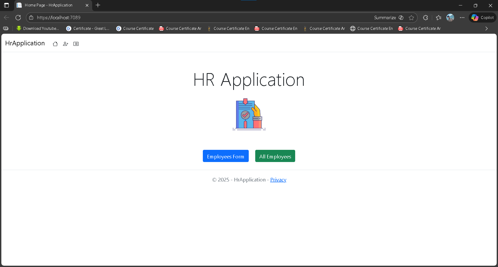
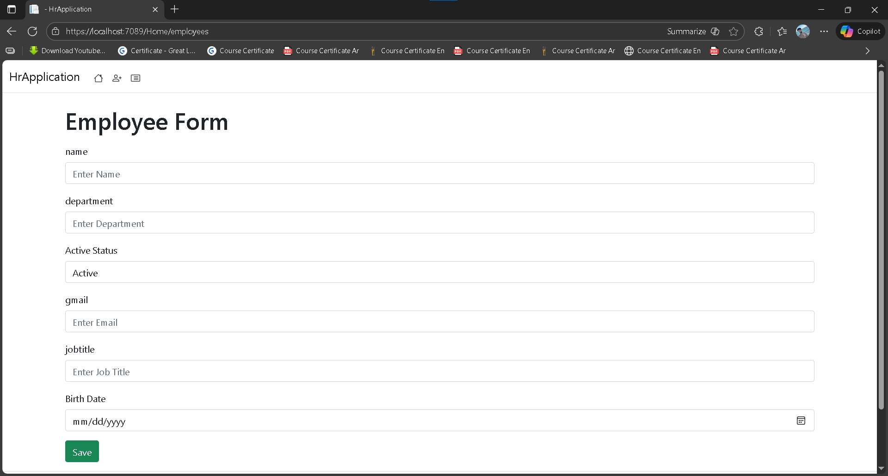
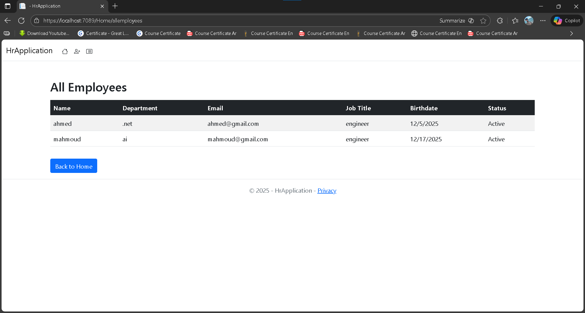
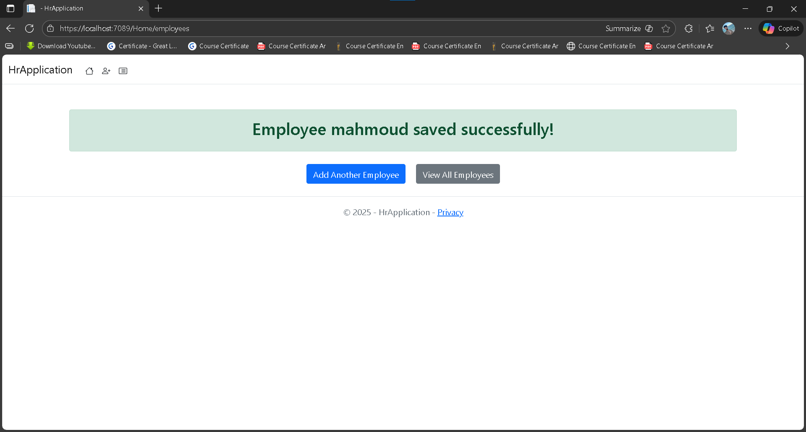

# HR-Application

**HR-Application** is a Human Resources management system built using **ASP.NET MVC** and **C#**, designed to manage employee data efficiently with validation and a responsive UI.

---

## Features

- **Add Employees:** Users can fill out a form to add new employee records.  
- **View All Employees:** Display a list of all employees with details like Name, Department, Job Title, Email, and Birthdate.  
- **Form Validation:** Ensures required fields are filled and email format is correct.  
- **Employee Activation:** Easily mark employees as active or inactive.  
- **Responsive UI:** Built using Bootstrap for a clean and modern interface.  

---

## Technologies Used

- **ASP.NET MVC**  
- **C#**  
- **Bootstrap 5**  
- **HTML/CSS**  

---

## Project Structure

HR-Application/
├── Controllers/
│ └── HomeController.cs
├── Models/
│ ├── employeescshtml.cs
│ └── repository.cs
├── Views/
│ ├── Home/
│ │ ├── Index.cshtml
│ │ ├── Privacy.cshtml
│ │ ├── employees.cshtml
│ │ ├── allemployees.cshtml
│ │ └── confirmpage.cshtml
│ └── Shared/
│ └── _Layout.cshtml
├── wwwroot/
│ ├── css/
│ ├── js/
│ └── lib/
└── README.md

---

## How to Run

1. Clone the repository:

```bash
git clone https://github.com/ahmeddkhaledd12/HR-Application.git
```
2.Open the solution in Visual Studio.

3.Build the solution (Ctrl + Shift + B).

4.Run the project (F5) and navigate to the home page.

5.Use the navigation links to add or view employees.

-------
Screenshots
## Screenshots

Home Page:


Employees Form:


All Employees Page:


Employee Saved:


--------

Built by Ahmed Khaled
